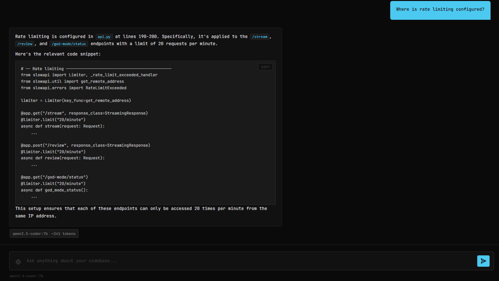
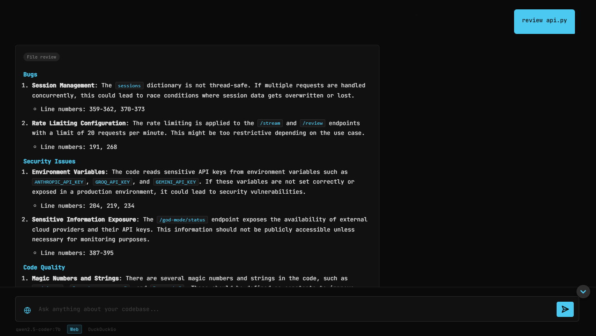
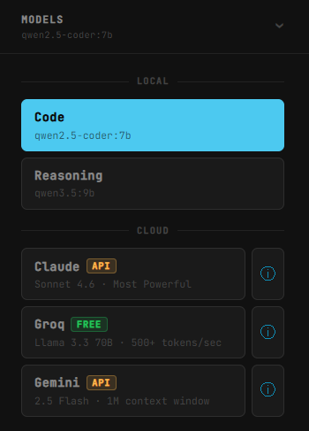
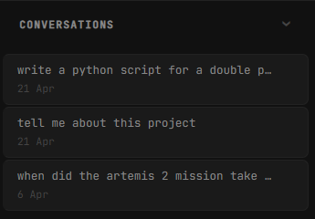

<div align="center">

# REX
### Repository Engineering eXpert

**A local-first AI developer assistant that understands your codebase**

[](https://github.com/tomadams2909/ai-dev-assistant/actions/workflows/ci.yml)


[What it is](#what-it-is) · [Architecture](#architecture) · [Stack](#stack) · [Getting Started](#getting-started) · [Features](#features) · [Testing](#testing)

</div>

---

## What it is

REX indexes your codebase using RAG (Retrieval-Augmented Generation) and lets you query it in natural language. It runs entirely on your machine by default - your code never leaves your computer unless you explicitly enable a cloud provider.

Ask REX to explain a function, find where authentication is handled, review a file for bugs, or switch to a cloud model with a 1M token context window. Every conversation is persisted and resumable across restarts.

```
"Where is token validation handled?"  →  REX retrieves the relevant code and explains it
"Review auth.py for security issues"  →  REX loads the full file and runs a structured analysis
"What changed in the FastAPI docs?"   →  REX searches the web and answers with citations
```



---

## Screenshots

### File review - structured four-section analysis


### Provider selector - switching between local and cloud models


### Session history - resumable conversations in the sidebar


---

## Architecture

```
┌─────────────────────────────────────────────────┐
│                   Browser UI                    │
│         HTML · CSS · Vanilla JS · SSE           │
└────────────────────┬────────────────────────────┘
                     │ HTTP / SSE
┌────────────────────▼────────────────────────────┐
│                  FastAPI Backend                │
│   /stream  /review  /ingest  /sessions  /usage  │
└──────┬──────────────┬────────────────┬──────────┘
       │              │                │
┌──────▼──────┐ ┌─────▼──────┐ ┌───────▼────────┐
│ Orchestrator│ │   Memory   │ │   Vector Store │
│  RAG + Tools│ │  Sessions  │ │   ChromaDB     │
└──────┬──────┘ └────────────┘ └────────────────┘
       │
┌──────▼──────────────────────────────────────────┐
│              Provider Abstraction               │
│        Ollama · Claude · Groq · Gemini          │
└─────────────────────────────────────────────────┘
```

**Provider abstraction** - all models implement a common `ModelProvider` interface (`chat`, `chat_stream`, `embed`). Adding a new provider is one class and one config line. `OpenAICompatibleProvider` is a reusable base for any OpenAI-format API.

**RAG injection strategy** - retrieved code chunks are injected into the current turn's prompt only and never written to session history. The model always gets fresh, relevant context without accumulating stale code across a long session.

**Streaming** - the backend yields SSE events (`token`, `done`, `error`). Think-tag blocks from reasoning models are stripped token-by-token in real time, with zero buffering latency.

**Safe file access** - all file operations resolve paths against the project root via `Path.resolve()` + `relative_to()` and reject anything that escapes it before the stream starts.

---

## Stack

| Layer | Technology |
|---|---|
| Backend | FastAPI · uvicorn |
| Vector DB | ChromaDB |
| LLM Providers | Ollama · Claude (Anthropic) · Groq · Gemini |
| Embeddings | Ollama - nomic-embed-text |
| Web Search | Anthropic native · Google grounding · DuckDuckGo fallback |
| Rate limiting | slowapi |
| Frontend | Vanilla JS · SSE · Prism.js |
| Testing | pytest · pytest-asyncio |
| CI | GitHub Actions |
| Deployment | Docker · docker-compose |

---

## Getting Started

### Prerequisites

- [Docker Desktop](https://www.docker.com/products/docker-desktop/) - recommended, everything else is handled
- NVIDIA GPU + [nvidia-container-toolkit](https://docs.nvidia.com/datacenter/cloud-native/container-toolkit/install-guide.html) — required for local model inference at usable speed
- Or: Python 3.13+ and [Ollama](https://ollama.com/download) for manual setup

> **CPU fallback:** remove the `deploy` block from `docker-compose.yml` — inference will work but be significantly slower.

### Docker (recommended)

```bash
git clone https://github.com/tomadams2909/ai-dev-assistant.git
cd ai-dev-assistant
docker compose up
```

Models are pulled automatically on first run (~11 GB, allow 5–15 min depending on connection).

```bash
cp .env.example .env
# Add API keys to .env to enable cloud providers (optional)
```

| Provider | Get API key | Env var |
|---|---|---|
| Claude (Anthropic) | [console.anthropic.com/settings/keys](https://console.anthropic.com/settings/keys) | `ANTHROPIC_API_KEY` |
| Groq | [console.groq.com/keys](https://console.groq.com/keys) | `GROQ_API_KEY` |
| Gemini | [aistudio.google.com/apikey](https://aistudio.google.com/apikey) | `GEMINI_API_KEY` |

<details>
<summary>Manual setup (without Docker)</summary>

```bash
git clone https://github.com/tomadams2909/ai-dev-assistant.git
cd ai-dev-assistant
python -m venv .venv
.venv\Scripts\activate        # Windows
# source .venv/bin/activate   # macOS / Linux
pip install -r requirements.txt
```

```bash
ollama pull nomic-embed-text
ollama pull qwen2.5-coder:7b
ollama pull qwen3.5:9b
```

```bash
python api.py
```

</details>

### Services

| Service | URL |
|---|---|
| REX UI | http://localhost:8000/app |
| API | http://localhost:8000 |
| API docs | http://localhost:8000/docs |

Once running, enter the path to any local project in the sidebar and click **Index Project**. REX chunks and embeds every file, then you can start querying.

---

## Features

### RAG pipeline

REX chunks source files into overlapping 60-line segments, embeds them with `nomic-embed-text`, and stores them in ChromaDB. On each query the most semantically relevant chunks are retrieved and injected into the prompt - never stored in history. This keeps the context window lean regardless of conversation length.

### Multi-provider LLM support

| Tier | Model | Cost | Strength |
|------|-------|------|----------|
| Local | qwen2.5-coder:7b, qwen3.5:9b | Free, offline | Privacy, zero cost |
| Cloud Free | Groq Llama 3.3 70B | Free | 10× local params, 500+ tok/s |
| Cloud Paid | Gemini 2.5 Flash | ~$0.001/query | 1M token context window |
| Cloud Premium | Claude Sonnet 4.6 | ~$0.04/query | Highest quality reasoning |

Switch providers per-query from the UI. Token usage and estimated cost are tracked per provider.

### File review

Load any indexed file into a cloud model's full context window and receive a structured four-section analysis: Bugs · Security Issues · Code Quality · Improvement Suggestions. File size is checked before the stream starts - oversized files are rejected with a clear error before any tokens are consumed.

### Tiered web search

- Claude → native Anthropic web search tool (autonomous, cited)
- Gemini → Google grounding (native SDK)
- Groq / Local → DuckDuckGo fallback (free, no API key required)

A single toggle controls web search across all providers. Automatically disabled when offline.

### Conversation memory

Sessions use a sliding window of 20 messages with compression. Older messages are summarised as plain text and prepended as a synthetic exchange so the model retains earlier context without inflating the token count. Sessions are persisted to disk and fully resumable after restarts.

### Customisation

Dark / Darker / OLED backgrounds, HSB accent colour picker with 36 curated swatches, sidebar width presets, and colour blind filters (Deuteranopia, Protanopia, Tritanopia, High Contrast).

---

## Testing

```bash
pytest tests/ -v
```

45 tests across 8 files covering the API endpoints, RAG injection strategy, memory management, provider abstraction, chunking pipeline, path traversal protection, and session persistence. All provider keys are stripped by `conftest.py` fixtures - the suite runs fully offline with no credentials required.

---

## Project Structure

```
ai-dev-assistant/
├── api.py               # FastAPI application, all HTTP endpoints
├── orchestrator.py      # RAG pipeline, streaming, think-tag stripping
├── ingest.py            # File scanning, chunking, embedding
├── retriever.py         # Semantic search against ChromaDB
├── memory.py            # Session persistence, history trimming
├── config.py            # Model names, paths, settings
├── usage_tracker.py     # Per-provider token and cost tracking
├── cli.py               # Optional terminal interface
├── models/
│   └── provider.py      # ModelProvider base + all provider implementations
├── tools/
│   ├── file_reader.py   # Safe full-file loading with path traversal protection
│   └── web_search.py    # DuckDuckGo fallback search
├── frontend/
│   ├── index.html       # Single-page UI
│   └── style.css        # Dark theme, CSS variables, animations
└── tests/
    ├── conftest.py          # Shared fixtures - API key isolation
    ├── test_api.py          # Endpoint tests
    ├── test_ingest.py       # Chunking and file scanning
    ├── test_memory.py       # Session, history trimming, persistence
    ├── test_orchestrator.py # RAG injection strategy
    ├── test_provider.py     # Provider interface and factory
    ├── test_retriever.py    # Vector store access
    ├── test_security.py     # Path traversal protection
    └── test_web_search.py   # Search fallback behaviour
```

---

## License

MIT - see [LICENSE](LICENSE)

---

<div align="center">
Built with FastAPI · ChromaDB · Ollama · Anthropic · Groq · Google Gemini
</div>
